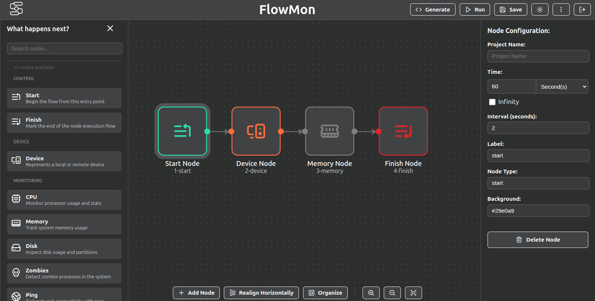

# Introdução ao FlowMon

Bem-vindo à documentação do **FlowMon**!

O FlowMon é uma ferramenta web baseada em metamodelagem projetada para a geração automatizada de scripts de monitoramento e rejuvenescimento de software.

*Figura 1. Tela principal do FlowMon.*

## O que o FlowMon faz?

O FlowMon permite a criação de fluxos de monitoramento de maneira visual, e a ferramenta transforma essas representações abstratas diretamente em scripts Shell (Bash) executáveis.

### Principais Funcionalidades

- **Monitoramento Flexível (Local e Remoto)**: Crie scripts para executar localmente ou realize a execução via SSH em dispositivos remotos.
- **Rejuvenescimento de Software Proativo**: Previna interrupções (como aquelas causadas por vazamentos de memória). O FlowMon restaura o sistema para um estado limpo antes que ocorram falhas catastróficas, usando técnicas preditivas ou limites fixos.
- **Gerador Baseado em Nós**: Abstrai completamente o código. A ferramenta infere automaticamente o uso de comandos Linux (`awk`, `grep`, `mpstat`, `free`, `ping`) com base no seu diagrama.

### Quer Saber Mais?

Saiba mais acessando o artigo:  
[FlowMon: A Workflow-Driven Visual Tool for Automated Monitoring Script Generation](https://link.springer.com/chapter/10.1007/978-3-032-11539-3_6)

:::tip[Sem Código Manual!]
Você não precisa ser um expert na linguagem Shell Script ou em integração de sistemas. O FlowMon resolve e empacota toda a complexidade, entregando um script estruturado, com _loops_ e documentação de logs sem uma única linha de código digitada.
:::